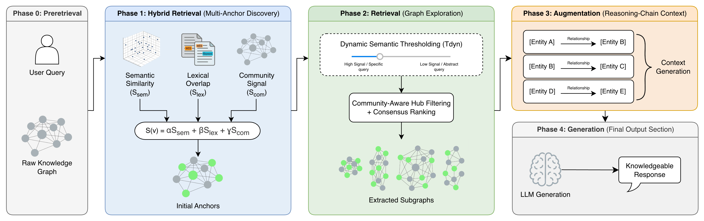

# 🧠 LiteRAG Architecture Deep Dive

LiteRAG fundamentally alters the Pareto frontier of Retrieval-Augmented Generation. Instead of using Large Language Models (LLMs) to make traversal decisions (e.g., *"Which node should I look at next?"*), LiteRAG utilizes optimized, programmatic algorithms.

    

The engine operates in three distinct phases:

## Phase 1: Multi-Strategy Anchor Discovery
To capture both broad thematic queries and hyper-specific factual lookups, LiteRAG uses a multi-strategy scoring function $S(v)$ to find the best starting nodes (anchors):

$$ S(v) = \alpha S_{sem} + \beta S_{lex} + \gamma S_{comm} $$

*   **$S_{sem}$ (Semantic)**: Cosine similarity via LanceDB vector search. Captures the "intent" of the query.
*   **$S_{lex}$ (Lexical)**: BM25 + Levenshtein distance. Crucial for exact noun-matching (e.g., specific names, acronyms) that embeddings sometimes miss.
*   **$S_{comm}$ (Community)**: Pulls context from the hierarchical community the node belongs to.

Nodes exceeding a strict threshold $\tau_{anchor}$ become the seed points for Phase 2.

## Phase 2: Parallel Graph Exploration (Zero-LLM)
This is the core of LiteRAG. We perform a Breadth-First Search (BFS) concurrently across all anchors using a ThreadPool. 

### Dynamic Semantic Thresholding
Fixed similarity thresholds fail in real-world KGs. LiteRAG calculates a dynamic threshold ($\tau_{dyn}$) based on the maximum signal strength of the discovered anchors:

$$ \tau_{dyn} = \tau_{base} + (\lambda \cdot \max_{a \in A} S(a)) $$

*   **High Signal**: If the query hits a specific entity cleanly, $\tau_{dyn}$ increases, enforcing a narrow, strict search to prevent topic drift.
*   **Low Signal**: If the query is abstract, $\tau_{dyn}$ remains low, allowing the algorithm to explore broader semantic neighborhoods.

### Community-Aware Hub Filtering
Graph traversal often suffers from the "Supernode" problem, where generic terms (e.g., "System", "Performance") bridge unrelated clusters, polluting context. LiteRAG introduces a penalty function $P_{hub}(v)$:

$$ R(v) = (S_{sem}(q,v) \cdot d^k) \cdot P_{hub}(v) $$

Where $P_{hub}$ mathematically distinguishes between "Generic Hubs" (penalized heavily) and "Topic Hubs" (protected because they are central to a specific community).

## Phase 3: Reasoning-Chain Context Assembly
Standard GraphRAGs dump raw text or massive community summaries into the LLM context. This dilutes **Linguistic Density**.

LiteRAG ranks the explored subgraphs and translates the topological relationships into explicit causal strings, known as **Reasoning Chains**:

> `[Entity A] is connected to [Entity B] via *Description of the relationship*`

By pre-computing these logical links, the LLM is no longer forced to deduce latent relationships across disparate paragraphs. It simply reads the causal map and generates the answer. This **Contextual Compression** reduces token usage by up to 99% while maintaining SOTA reasoning accuracy.

For more detailed information, see the LiteRAG paper: https://arxiv.org/abs/2609.10239.